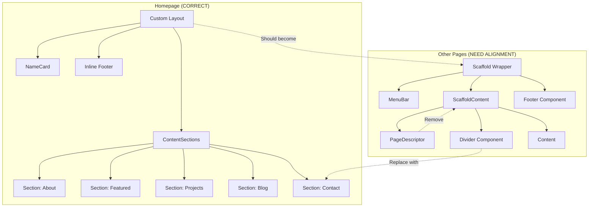

# Design Analysis: Homepage Pattern

## Overview

This document analyzes the exact design patterns used in HomePage.tsx to create a reference for aligning all other pages.

## Homepage Structure

### Layout Architecture

The homepage uses a **custom layout without Scaffold wrapper**:

```
HomePage.tsx
├── Mobile Layout (lg:hidden)
│   ├── NameCard (centered, full viewport)
│   ├── ContentSections (stacked, max-w-3xl)
│   └── Footer (inline, border-t)
└── Desktop Layout (hidden lg:flex)
    ├── Left Panel (42% width, sticky, NameCard)
    └── Right Panel (58% width, ContentSections + Footer)
```

### Key Design Decisions

1. **No Scaffold wrapper** - The homepage does NOT use `Scaffold`, `ScaffoldContent`, or `MenuBar` components. It renders its own layout directly.

2. **Two layout modes** - Mobile uses stacked layout, desktop uses side-by-side with sticky name card.

3. **Inline footer** - Footer is part of the page structure, not a separate component.

4. **Custom NameCard** - The name card is rendered inline with Playfair Display font for the name.

## Color System

### Homepage Uses `text-fg*` Classes (NOT `text-gb-fg*`)

| Element | Color Class | Value |
|---------|------------|-------|
| Primary text | `text-fg0` | `#fbf1c7` |
| Secondary text | `text-fg` | `#ebdbb2` |
| Tertiary text | `text-fg2` | `#d5c4a1` |
| Muted text | `text-fg3` | `#bdae93` |
| Dim text | `text-fg4` | `#a89984` |
| Background | `bg-bg0` | `#1d2021` |
| Border | `border-bg2` | `#504945` |
| Hover border | `border-fg3` | `#bdae93` |

### Contrast with Other Pages

Other pages incorrectly use `text-gb-fg*` classes which are from the gruvbox-theme.css and have different values. The homepage uses the legacy `text-fg*` classes defined in the Tailwind theme.

## Typography

### Fonts Used

| Element | Font | Weight |
|---------|------|--------|
| Name | Playfair Display | font-black (900) |
| Section headers | Inter (font-sans) | normal |
| Body text | Inter (font-sans) | normal |
| Project titles | Inter (font-sans) | font-bold |
| Labels/tags | Inter (font-sans) | normal |
| Footer | Montserrat (font-montserrat) | normal |

### Font Sizes

| Element | Size |
|---------|------|
| Name | `text-5xl sm:text-6xl md:text-7xl` |
| Tagline | `text-xs` |
| Section headers | `text-[10px]` uppercase tracking-[0.2em] |
| Section titles | `text-2xl sm:text-3xl` |
| Body text | `text-sm sm:text-base md:text-lg` |
| Links | `text-xs` |
| Footer | `text-[10px]` |

## Section Pattern

### Standard Section Structure

```tsx
<section className="max-w-2xl">
    <h2 className="text-fg4 font-sans uppercase tracking-[0.2em] text-[10px] mb-6">
        SECTION LABEL
    </h2>
    {/* Content */}
    <div className="border-b border-bg2 mt-6" />
</section>
```

### Section Spacing

- Sections use `gap-24` in a flex column container
- Each section has `max-w-2xl` width constraint
- Section labels are uppercase, 10px, with wide letter-spacing
- Dividers use `border-b border-bg2 mt-6`

### Content Types

1. **About section** - Plain text paragraph with `text-fg2`
2. **Featured project** - Uses FeaturedTeaser component
3. **Project list** - Uses ProjectRow component with expand/collapse
4. **Blog section** - Link to blog with optional post previews
5. **Contact section** - Email links with `text-fg`

## Component Patterns

### FeaturedTeaser

```tsx
<a href="..." className="block group transition-all duration-300 hover:opacity-70">
    <div className="flex items-center gap-2 mb-2">
        <span className="px-2 py-0.5 text-[10px] font-sans uppercase tracking-widest rounded-sm ...">
            STATUS
        </span>
    </div>
    <h3 className="text-2xl sm:text-3xl font-bold font-sans text-fg0 mb-2 transition-colors duration-300 group-hover:text-fg1">
        TITLE
    </h3>
    <p className="text-fg3 text-sm font-sans leading-relaxed max-w-lg transition-colors duration-300 group-hover:text-fg2">
        DESCRIPTION
    </p>
</a>
```

### ProjectRow

```tsx
<div className="border-b border-bg2">
    <button className="group w-full flex items-center justify-between gap-4 py-4 hover:border-fg3 transition duration-300 text-left">
        <div className="flex flex-col sm:flex-row sm:items-baseline gap-1 sm:gap-3">
            <span className="text-fg text-sm sm:text-base font-sans font-semibold">TITLE</span>
            <span className="text-fg4 text-xs font-sans">TECHS</span>
        </div>
        <MdOutlineArrowOutward size={12} className="shrink-0 transition duration-300 ..." />
    </button>
    {/* Expanded content */}
</div>
```

## Spacing System

| Token | Value | Usage |
|-------|-------|-------|
| Section gap | `gap-24` | Between sections |
| Section padding | `px-4 sm:px-8 md:px-12` | Content containers |
| Mobile padding | `px-6 sm:px-12 md:px-24` | Mobile content |
| Desktop padding | `px-12 xl:px-20` | Desktop panels |
| Desktop top padding | `py-[20vh]` | Desktop content top |
| Divider margin | `mt-6` | After sections |
| Footer margin | `mt-24` | Before footer |

## What Other Pages Do WRONG

### BlogListPage.tsx
- Uses `Scaffold` wrapper (homepage doesn't)
- Uses `ScaffoldContent` with `py-32` padding
- Uses `PageDescriptor` component (homepage doesn't use this)
- Uses `Divider` component (homepage uses `border-b`)
- Uses `text-gb-fg*` colors instead of `text-fg*`
- Uses `border-gb-bg2` instead of `border-bg2`
- Has `max-w-3xl` instead of `max-w-2xl` for sections

### BlogPostPage.tsx
- Uses `Scaffold` wrapper
- Uses `ScaffoldContent` with `py-32` padding
- Uses `PageDescriptor` component
- Uses `Divider` component
- Uses `text-gb-fg*` colors
- Has custom layout instead of matching homepage pattern

### PhotosPage.tsx
- Uses its own header/footer structure
- Uses `text-fg*` colors (correct)
- Has different layout structure
- Uses `border-bg2` (correct)
- Missing the section pattern from homepage

### ProjectsPage.tsx
- Uses `Scaffold` wrapper
- Uses `ScaffoldContent`
- Uses `PageDescriptor` component
- Uses `Divider` component
- Uses `text-gb-fg*` colors
- Has grid layout (homepage uses section layout)

### ContactPage.tsx
- Uses `Scaffold` wrapper
- Uses `ScaffoldContent`
- Uses `text-gb-fg*` colors
- Has different layout structure

### AboutPage.tsx
- Uses `Scaffold` wrapper
- Uses `ScaffoldContent`
- Uses `PageDescriptor` component
- Uses `text-gb-fg*` colors
- Has timeline layout (different from homepage)

## Alignment Requirements

### Must Match Homepage Exactly

1. **Color classes**: Use `text-fg*`, `bg-bg*`, `border-bg*`, `border-fg*` (NOT `text-gb-fg*`, etc.)
2. **Section pattern**: Use `max-w-2xl`, section headers with `text-[10px] uppercase tracking-[0.2em]`
3. **Dividers**: Use `border-b border-bg2 mt-6` (NOT `Divider` component)
4. **Typography**: Use `font-sans` (Inter), `font-playfair` (Playfair Display)
5. **Spacing**: Use `gap-24` between sections, `max-w-2xl` for content

### Should Match Homepage Pattern

1. **No PageDescriptor**: Use direct h2/h3 elements like homepage
2. **No Scaffold wrapper**: Use direct page structure (or at least match the visual result)
3. **Consistent hover transitions**: Use `duration-300` with color changes
4. **No rounded borders**: Except for small tags/badges with `rounded-sm`
5. **Consistent link styling**: Underline with `decoration-fg4 hover:decoration-fg2`

## Mermaid: Page Structure Comparison



## Connections

- [[../rough-idea]] - Project overview
- [[../design/page-alignment]] - Design specification
- [[../implementation/plan]] - Implementation steps
